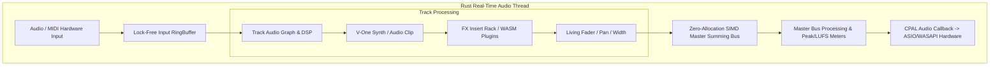

# VIBE Architecture: The Interaction Workstation

VIBE is a state-of-the-art Digital Audio Workstation (DAW) designed for high-performance audio production, featuring a hybrid Rust/React architecture with a focus on zero-allocation DSP and ultra-responsive UI.

---

## 1. Technology Stack

- **Frontend**: React 18 + TypeScript + Vite
  - **Visualization**: WebGL-accelerated waveform rendering (`WaveformGL.tsx`), Canvas-based Piano Roll and Mixer.
  - **Styling**: Vanilla CSS (Spectral Glass & Neon Aesthetic).
- **Backend (Audio Engine)**: Rust
  - **Audio I/O**: `cpal` with native ASIO support (Windows) and low-latency WASAPI/CoreAudio.
  - **DSP Core**: Custom SIMD-optimized summing engine (`wide` crate / AVX2).
  - **Concurrency**: Lock-free RingBuffers (`rtrb`) for inter-thread communication.
  - **Plugin Hosting**: Native VST3 bridge and WASM-sandboxed effects (`wasmer`).
- **Interop**: Tauri v2 IPC bridge.

---

## 2. Audio Signal Flow Architecture



---

## 3. IPC Interop & Event Bus Architecture

```mermaid
graph LR
    subgraph Frontend [React UI Thread]
        UI[Timeline / Mixer Component] -- "invoke('slice_clip')" --> Bridge[Tauri Core Bridge]
        Listeners[Tauri Event Listener] <-- "emit('project_updated')" -- EventBus[Tauri Event Bus]
    end

    subgraph Backend [Rust Core]
        Bridge --> Commands[Tauri Command Handlers]
        Commands --> State[Shared Project State]
        State -- "RingBuffer Msg" --> AudioThread[Audio Callback Engine]
        AudioThread -- "Fast Polling" --> Telemetry[Atomic Metering / Peak Buffer]
        Telemetry --> UI
        Commands --> EventBus
    end
```

---

## 4. Core Modules Summary

### 4.1 Audio Engine (`src-tauri/src/engine/audio.rs`)
The heart of VIBE. Manages the audio callback, command processing, and real-time state management.
- **Zero-Allocation**: No memory allocations inside the audio callback.
- **Buffer Swapping**: Uses atomic swaps and ring buffers for thread-safe state extraction.

### 4.2 Graph System (`src-tauri/src/engine/graph.rs`)
Defines the DSP structure of the DAW:
- **Tracks & Busses**: Sequential and parallel routing.
- **Processors**: `AudioProcessor` trait for all sound-generating and modifying units.
- **Automation**: High-precision Akima spline interpolation for all parameters.

### 4.3 Kropelka AI Copilot (`src-tauri/src/engine/kropelka/`)
- **Neural Forest Classifier**: Real-time evaluation of session telemetry (clipping, RMS, spectral tilt).
- **Proactive Interventions**: Automated recommendations for EQ, gain staging, and chord suggestions.

### 4.4 Persistence (`src-tauri/src/engine/persistence/`)
- **VIBE Binary Format**: Fast, bit-perfect project saving using `bincode`.
- **Atomic Save**: Crash-resistant project writing and auto-recovery.
