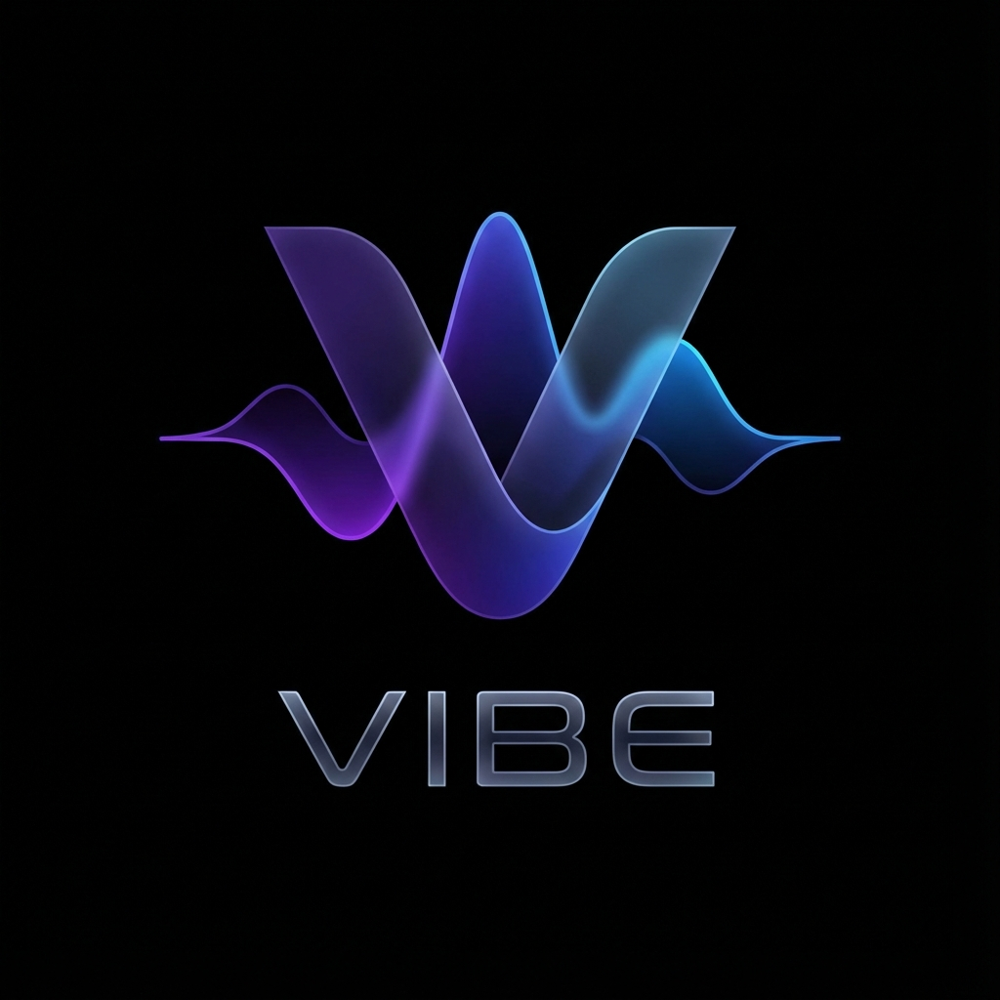

# 🚀 VIBE Digital Audio Workstation

A high-performance, next-generation Digital Audio Workstation (DAW) built with **Tauri 2.0, Rust (AVX-512 SIMD Engine), WebGL, and Kropelka AI**.



## 📌 Repository Location
Official GitHub Repository: [https://github.com/V1B3hR/VIBE](https://github.com/V1B3hR/VIBE)

## ⚙️ Core Stack & Architecture
- **Audio Engine:** 64-bit lock-free audio summing, SIMD AVX-512 acceleration, sub-10ms round-trip latency.
- **AI Copilot:** Kropelka v3.0 ML bridge (session mood sensing, intelligent EQ rules, flow-adaptive persona).
- **Plugins & Instruments:** VST3 SDK binary probing, WASM sandboxed hosting (`wasmer`), V-One Synth factory presets.
- **Modular Workflows:** UnMod universal modulation system, non-linear dual-view clip launcher grid, cross-DAW session importer (`.als`, `.rpp`, `.flp`).

## 🛠️ Getting Started

### Prerequisites
- [Rust](https://www.rust-lang.org/tools/install) (1.75+)
- [Node.js](https://nodejs.org/) (18+)

### Running Locally
```bash
# Install frontend dependencies
npm install

# Launch Tauri 2.0 Dev Server
npm run tauri dev

# Run unit tests
npm run test:all
```

## 📜 License & CLA
VIBE DAW is distributed under a **Dual-Licensing Model**:
- **Open-Source License:** [GNU General Public License v3.0 (GPLv3)](LICENSE).
- **Commercial Enterprise License:** Available for proprietary deployments and commercial commercialization.
- **Contributions:** All external contributions require agreeing to the [Contributor License Agreement (CLA)](CLA.md). See [CONTRIBUTING.md](CONTRIBUTING.md) for details.
